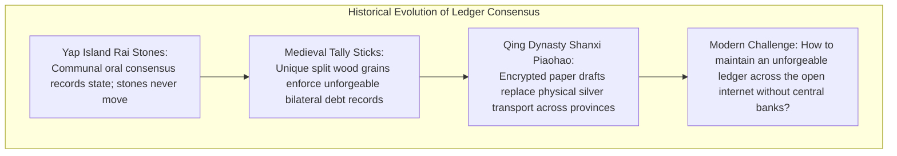
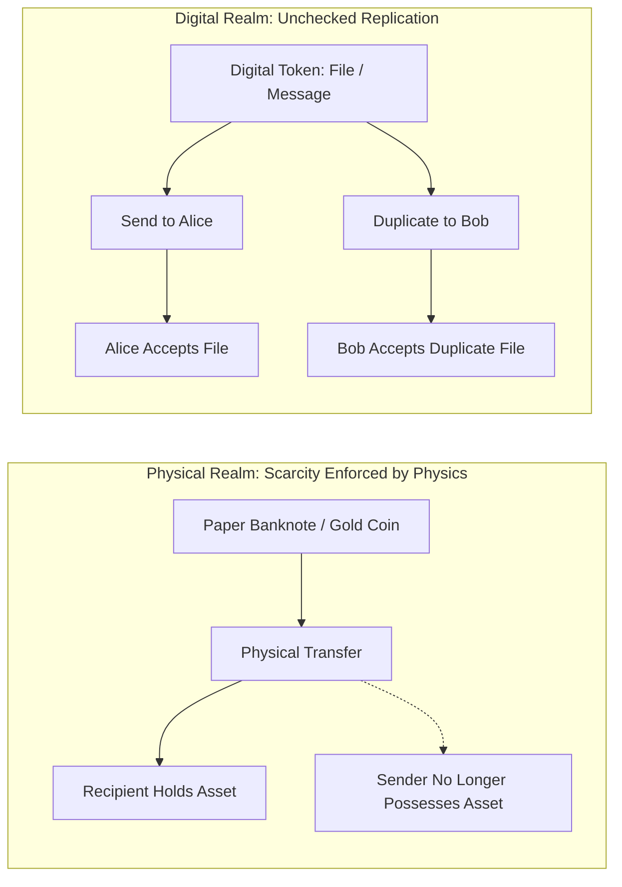
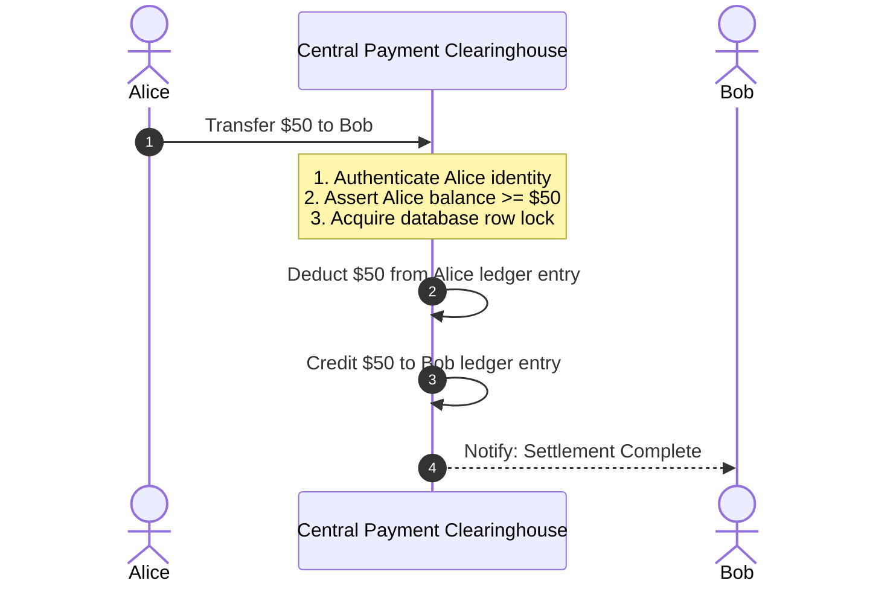
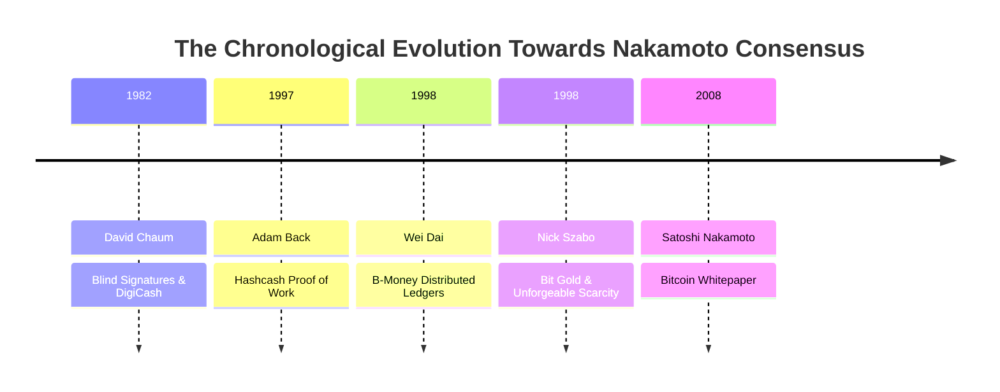
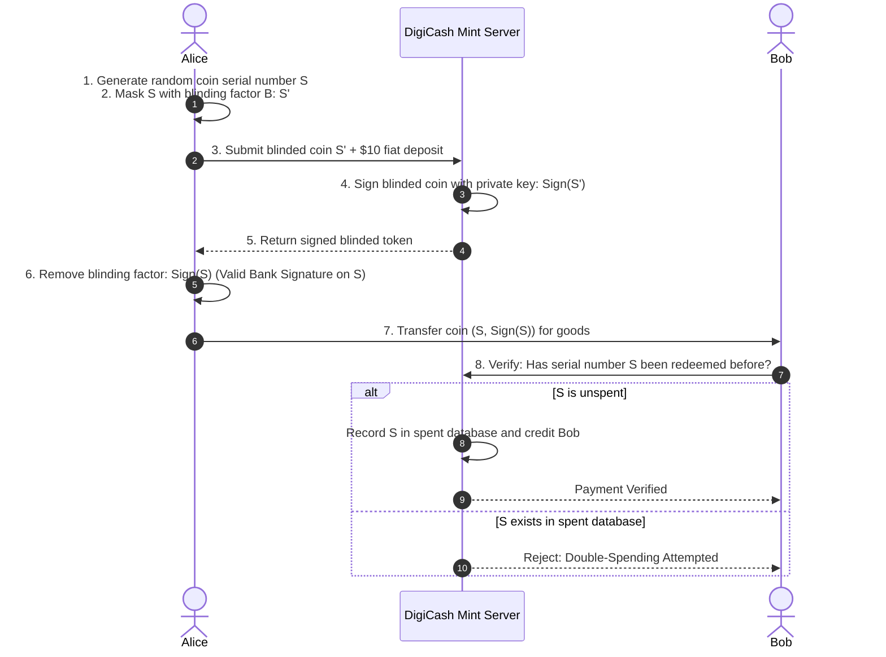
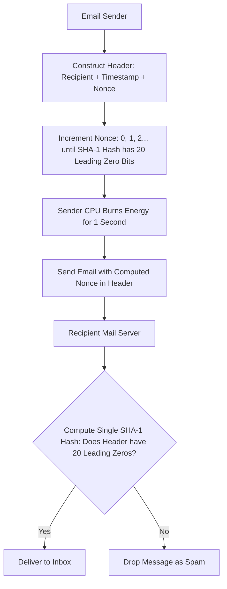
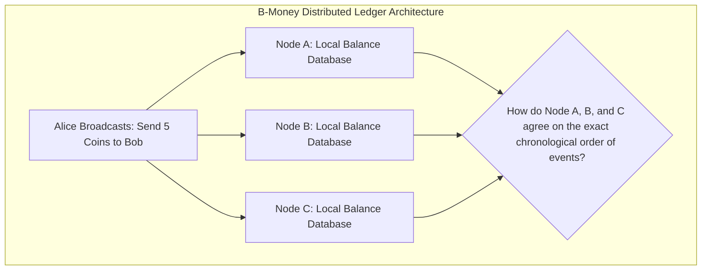
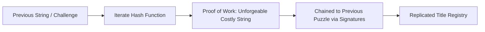
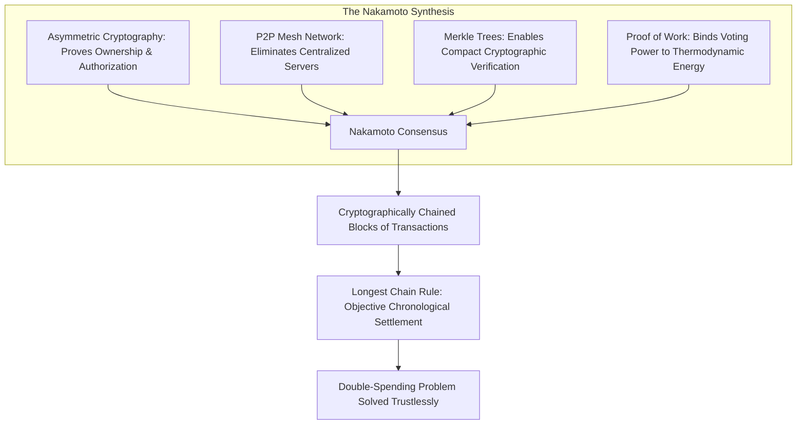

# The Double-Spending Problem and the History of Digital Cash

Money is fundamentally a coordination game and a social technology for recording debt.
Throughout human history, money has never been about the physical substance itself.
Instead, money functions as a ledger: a shared, credible record of who owes what to whom across time and space.

Before modern banking, societies repeatedly discovered that ledger consensus mattered far more than physical custody:
- **The Rai Stones of Yap Island:**
  On the Micronesian island of Yap, islanders used giant circular limestone discs called *fei* or Rai stones as currency.
  Because these stones weighed several metric tons and were quarried hundreds of miles away in Palau, they were rarely moved physically.
  Instead, when a transaction occurred, the entire village gathered to publicly witness the transfer of ownership.
  The new owner was acknowledged through collective oral consensus.
  In one famous historical instance, a large stone was lost at sea during a storm and sank to the ocean floor.
  Because the crew testified to the event and the village agreed on the quarrying effort, the stone retained its purchasing power across generations.
  The value resided in the communal ledger, not in physical possession.
- **Medieval English Tally Sticks:**
  From the twelfth to the nineteenth century, the British Exchequer and European merchants recorded debts using hazelwood tally sticks.
  Notches were carved into a stick to represent monetary sums.
  The wood was then split lengthwise through the notches into two unequal pieces: the *stock* held by the creditor and the *foil* held by the debtor.
  Because the natural wood grain and jagged split could never be matched by a counterfeit piece of wood, the physical split acted as an unforgeable analog cryptographic key.
- **The Shanxi Piaohao of the Qing Dynasty:**
  In eighteenth-century China, transporting physical silver ingots across bandit-ridden mountain trade routes was dangerous and expensive.
  Merchants in Shanxi established *piaohao* (draft banks), inventing encrypted paper remittance drafts stamped with complex seals and written in secret watermarked ciphers.
  A merchant could deposit silver in Beijing, carry a lightweight paper draft across the country, and redeem it for silver in Guangzhou.
  The physical metal remained locked in vaults while economic value traveled as authenticated ledger instructions.

These historical precedents demonstrate an enduring reality: whenever commerce expands beyond physical hand-to-hand barter, humans replace the transport of physical matter with the transmission of ledger state.

## The Digital Cash Dilemma: Unchecked Replication

The arrival of the internet dissolved geographic boundaries, allowing information to travel globally at the speed of light.
However, digital information is fundamentally composed of bits: zeroes and ones.
By its very mathematical nature, digital information can be replicated infinitely, perfectly, and at virtually zero marginal cost.

When you send someone an email, an image, or a document, you are not transferring the original object.
You are creating a duplicate copy on their machine while retaining the original file intact on your hard drive.
This property is extraordinary for the distribution of knowledge, but it is catastrophic for money.

If a digital coin were simply a computer file, say `token.dat`, a spender could copy that file multiple times and transmit it to different recipients simultaneously.
This mathematical vulnerability is **The Double-Spending Problem**.

### The Mechanics of an Exploit

Consider an adversarial scenario involving three participants:
1. Alice possesses a digital token representing ten dollars.
2. Alice transmits the token to Bob in exchange for goods.
3. At the exact same fraction of a second, Alice transmits the identical token to Charlie to purchase a service.
4. Both Bob and Charlie receive valid bits that pass initial checks.
5. Both merchants release their products under the assumption that they have been settled.

Yet, only ten dollars of economic value existed initially.
Alice has duplicated her purchasing power out of thin air, defrauding either Bob, Charlie, or the wider network.

For any digital currency to function as an honest medium of exchange, the underlying protocol must guarantee three invariant properties:
1. **Unforgeability:** Units of currency cannot be counterfeited or created outside established monetary rules.
2. **Authenticity:** Only the rightful owner of a balance possesses the mathematical authority to transfer it.
3. **Exclusivity (Double-Spend Prevention):** Once value is transferred, the previous owner is permanently prevented from spending that same unit ever again.

## The Traditional Solution: Centralized Clearinghouses

Prior to distributed ledgers, every digital payment network solved the double-spending problem by introducing a centralized intermediary.
This model underpins modern commercial banks, credit card networks (Visa, Mastercard), automated clearing houses (ACH), and digital payment apps.

In a centralized system, money is not a self-contained digital token carried on a user device.
Instead, money exists exclusively as an entry in a private, centralized database managed by a trusted institution.

When Alice pays Bob electronically:
1. Alice does not hand a cryptographic object directly to Bob.
2. Alice sends an authenticated payment request to the central server.
3. The bank queries its internal database to confirm Alice holds sufficient funds.
4. If Alice attempts to send the same funds to Charlie concurrently, the bank's database serialization engine locks Alice's record, executes one request, and rejects the second.
5. The bank updates its internal records by mutating Alice and Bob's account balances.

### Structural Costs of Centralized Intermediation

Centralized clearinghouses solve double-spending effectively, but this architecture introduces deep systemic trade-offs:

- **Single Point of Failure:** If the centralized database or its host infrastructure suffers an outage, hardware crash, or cyberattack, the entire economic network depending on that server halts immediately.
- **Censorship and Financial Exclusion:** Because the database operator exercises unilateral control over state updates, it possesses the power to freeze funds, reverse settled transactions, or deny access to individuals and organizations based on commercial discretion or political pressure.
- **Surveillance and Privacy Erosion:** Every transaction must be inspected, cataloged, and stored by the intermediary, transforming private economic behavior into harvestable behavioral data.
- **Monetary Debasement:** When centralized ledgers are controlled by sovereign monetary authorities without programmatic supply constraints, total ledger units can be expanded arbitrarily, diluting the purchasing power of all participants.
- **Monopolistic Rent Extraction:** Central payment rails routinely extract two to four percent interchange fees on every transaction, imposing a persistent frictional tax across global commerce.

The defining technical challenge of late-twentieth-century cryptography was to build an electronic payment system that preserved the convenience of digital networks while restoring the peer-to-peer, self-sovereign, and censor-resistant properties of physical cash.

## The Historical Ancestry of Digital Cash

Bitcoin was not an overnight discovery.
Satoshi Nakamoto synthesized decades of cryptographic primitives and experimental protocols created by the **Cypherpunks**: an informal community of mathematicians, computer scientists, and privacy researchers active from the late 1980s onward.

### 1. David Chaum and DigiCash (1982 - 1998)

Dr. David Chaum pioneered the mathematical foundations of electronic money in 1982 with his paper *Blind Signatures for Untraceable Payments*.
In 1989, Chaum founded **DigiCash** to commercialize cryptographic cash through a protocol called **eCash**.

DigiCash introduced the concept of **Blind Signatures**.
In traditional digital signatures, an authority inspects a message before signing it.
In Chaum's blind signature scheme, a user can have a digital token validated by a bank without the bank ever seeing the token's serial number.

#### The Blind Signature Analogy

Imagine placing a piece of paper containing a unique serial number inside an envelope lined with carbon paper.
You hand the sealed envelope to a bank teller alongside ten dollars of fiat currency.
The teller signs the outside of the envelope with an ink pen.
The pressure transfers the signature through the carbon paper directly onto the secret sheet inside.
You reclaim the envelope, open it, and remove the signed slip.
You now possess a ten-dollar note certified by the bank's signature, yet the bank never observed the serial number written on that note.

When Alice gives this coin to Bob:
1. Bob contacts the DigiCash server before delivering goods.
2. The bank confirms its signature is authentic.
3. The bank checks its central database of spent serial numbers.
4. If the serial number is absent, the bank records it as spent, credits Bob's balance, and issues Bob a fresh coin.
5. If the serial number was already recorded, the bank rejects the token as an attempted double-spend.

#### Why DigiCash Failed

DigiCash achieved mathematical anonymity: the bank could not link Alice's withdrawal to Bob's deposit.
However, it retained two fatal vulnerabilities:
- **Real-Time Centralized Verification:** Double-spending could only be caught if the central mint inspected every transaction before settlement.
- **Operational Centralization:** DigiCash was a corporation registered in the Netherlands.
  When the company went bankrupt in 1998 due to adoption hurdles, its mint servers powered down, rendering all eCash tokens completely worthless.

DigiCash demonstrated that cryptography could guarantee privacy, but relying on a centralized server left the system vulnerable to corporate failure, regulatory shutdown, and physical seizure.

### 2. Adam Back and Hashcash (1997)

As the internet expanded, open protocols like SMTP email were overwhelmed by spam and denial-of-service attacks.
Because sending an email carried zero marginal cost, an attacker could broadcast millions of unsolicited messages per hour effortlessly.

In 1997, British cryptographer Dr. Adam Back proposed **Hashcash** to introduce economic friction to network communication.
Hashcash forced a sender's computer to solve an arbitrary, computationally demanding cryptographic puzzle before an email would be accepted.

#### Cost Functions and Asymmetric Verification

The sender structures a header containing the recipient's email address, a timestamp, and a counter called a **nonce**.
The sender must find a nonce such that the hash of the header begins with a required number of binary zeroes (such as 20 leading zero bits).

Because cryptographic hash outputs cannot be predicted, the sender has no mathematical shortcut.
The sender's processor must test millions of candidate nonces sequentially until it finds a match.
For an ordinary user sending ten emails daily, burning one second of processing time per email is negligible.
For an attacker attempting to broadcast ten million spam emails daily, the required computational power becomes physically and financially impossible.

Crucially, while finding the solution requires substantial physical computation, verifying the solution requires a single hash calculation by the recipient.
This property of **asymmetric verification** (difficult to compute, trivial to verify) became known as **Proof of Work (PoW)**.

Hashcash successfully mitigated spam, but it was not money:
- Hashcash tokens could not be transferred from one recipient to another.
- Because computing hardware naturally improves over time according to Moore's Law, older Proof of Work solutions rapidly lost value as newer hardware solved puzzles faster, preventing it from serving as a stable store of value.

### 3. Wei Dai and B-Money (1998)

In 1998, computer scientist Wei Dai published the **b-money** proposal on the Cypherpunk mailing list.
B-money was the first conceptual architecture for a digital currency that eliminated central mints by distributing ledger maintenance across a peer-to-peer network.

In Dai's first protocol proposal:
1. Every network participant maintains a synchronized copy of a shared ledger recording the balances of all public keys.
2. Money is minted by solving computational Proof of Work puzzles relative to a basket of standard goods.
3. Transactions are broadcast to all participants simultaneously, and each node updates its local ledger upon verifying the sender's digital signature.

#### The Chronological Ordering Dilemma

Wei Dai's proposal lacked a critical mechanism: **a decentralized method to achieve consensus on transaction ordering without a global clock**.

If Alice broadcasts "Send 10 coins to Bob" to one side of the network, and simultaneously broadcasts "Send the same 10 coins to Charlie" to the other side, physical network latency guarantees that different nodes hear different transactions first.
Because b-money possessed no mechanism to break ties or agree on chronological sequence in a trustless environment, independent ledgers would diverge permanently into conflicting states.

### 4. Nick Szabo and Bit Gold (1998)

Around the same time, cryptographer and legal scholar Nick Szabo designed **Bit Gold**, widely recognized as the direct architectural predecessor to Bitcoin.

Szabo examined monetary history through an anthropological lens.
He observed that across millennia, durable monetary commodities (such as seashells, wampum beads, silver, and gold) shared a core trait: **unforgeable costliness**.
Creating them required genuine, unavoidable physical sacrifice or skilled labor that could not be faked by edict or counterfeiters.

Szabo sought to recreate unforgeable costliness in the digital domain using chained hash puzzles:
1. A participant creates a string of bits by solving a computationally intensive hash puzzle based on a public challenge.
2. The resulting solution is timestamped and signed with the finder's cryptographic key.
3. The newly generated unit is registered in a distributed title registry where independent servers record property rights.
4. Each newly generated puzzle incorporates the hash of the preceding puzzle, forming an unbroken cryptographic chain of work.

#### The Quorum Vulnerability (Sybil Attacks)

Bit Gold solved digital scarcity, but its title registry relied on classical voting: an agreement among a majority of server network addresses.
Szabo recognized that on an open, permissionless network, an adversary could spin up thousands of virtual server identities across distinct IP addresses for minimal cost and easily outvote honest participants.
This vulnerability is the **Sybil attack**.
Unable to solve how a decentralized network could agree on ledger ownership without succumbing to Sybil manipulation, Bit Gold was never implemented in production software.

## The Nakamoto Synthesis

In October 2008, an anonymous researcher under the pseudonym **Satoshi Nakamoto** published an eight-page paper titled *Bitcoin: A Peer-to-Peer Electronic Cash System*.

Nakamoto did not invent new cryptographic primitives.
Instead, Nakamoto assembled asymmetric key cryptography (1970s), Merkle trees (1979), peer-to-peer gossip networking (1990s), and Hashcash Proof of Work (1997) into an elegant, game-theoretically stable consensus engine.

Nakamoto resolved the double-spending problem through two breakthrough mechanisms:

### 1. Proof of Work as a Sybil-Resistant Voting Mechanism

Instead of counting votes by counting IP addresses or server accounts (which can be forged cheaply), Nakamoto tied voting power directly to thermodynamic hashing power: **one-CPU-one-vote** (more accurately, one-hash-per-second-one-vote).
An attacker cannot outvote the network simply by deploying millions of virtual nodes.
The attacker must physically acquire and operate more computational energy than the honest participants combined.

### 2. Chained Blocks and the Longest-Chain Rule

Nakamoto solved the chronological ordering dilemma that stalled b-money and Bit Gold by grouping transactions into sequential **blocks**.
Each block contains:
- A cryptographic hash referencing the header of the previous block.
- A batch of verified transactions organized in a Merkle tree.
- A Proof of Work nonce proving that substantial computational energy was expended to validate this specific batch.

Because each block cryptographically references its predecessor, modifying any historical transaction requires recomputing the Proof of Work for that block and every subsequent block built on top of it.

If two conflicting transactions are broadcast simultaneously (an attempted double-spend), miners work on whichever block arrives first.
Inevitably, one branch will mine a subsequent block first due to the Poisson distribution of hash discovery.
Nakamoto established the universal consensus rule: **Nodes must always adopt the valid chain that contains the greatest accumulated Proof of Work as the objective truth.**

## The Next Question: How Does Cryptography Prove State Without Trust?

Nakamoto consensus solved how thousands of anonymous nodes agree on the ordering of ledger history.
However, this architecture introduces a new technical challenge:
How can any participant verify that thousands of transactions inside a block are authentic, untampered, and correctly sequenced without downloading and re-reading the entire history of the world?

If verifying a ledger requires checking every byte from scratch, the system will eventually buckle under its own data weight.
To understand how distributed ledgers achieve mathematically airtight verification in constant time, we must examine the mathematical bedrock of all decentralized state machines: **Cryptographic Hash Functions and Merkle Trees**.
