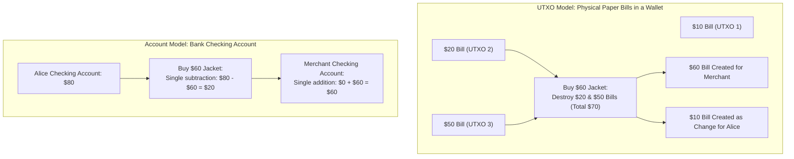
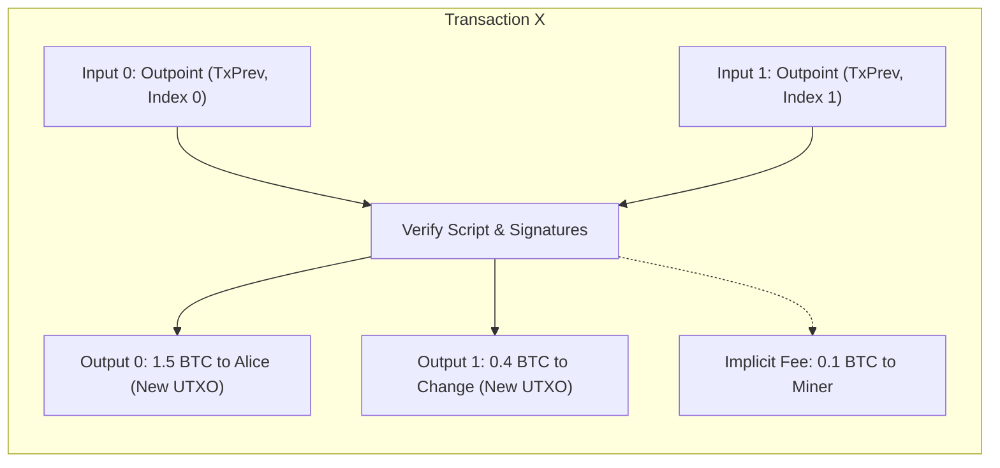
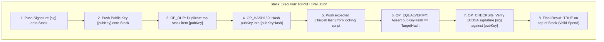
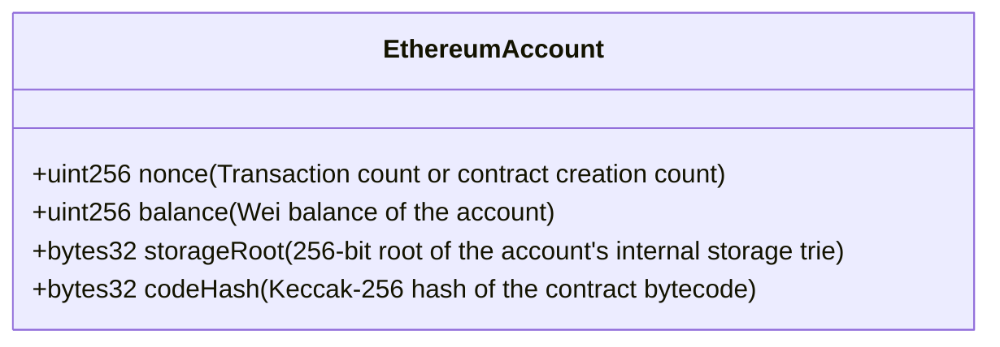
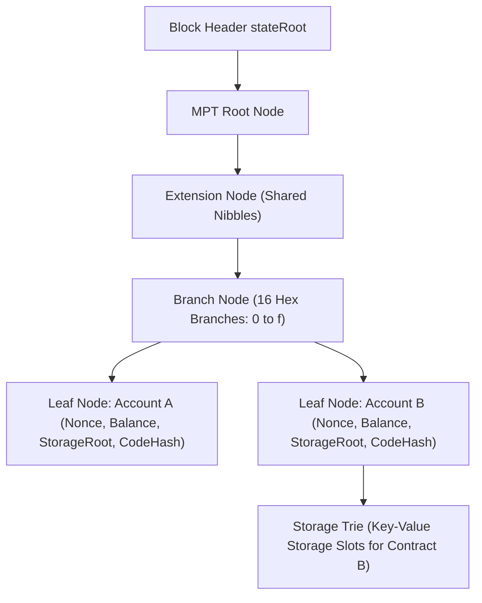

# Ledger State Models: UTXO vs. Account Model

In the previous module, we traced how a transaction travels from client signing to block execution via the state transition function:

$$\sigma_{t+1} = \Pi(\sigma_t, B_{t+1})$$

However, this formal equation leaves open a deeper architectural question: what does the world state $\sigma$ actually look like inside a node's memory and on disk?

Every blockchain is fundamentally a distributed state machine maintaining a ledger of ownership.
How that ledger is conceptualized, organized in database indexes, and updated during execution differs profoundly across networks.

In distributed systems engineering, there are two primary architectures for tracking state:
1. **The UTXO Model (Unspent Transaction Output):** Used by Bitcoin, Cardano, Monero, and Kaspa.
2. **The Account / Balance Model:** Used by Ethereum, Solana, Cosmos, and traditional banking systems.

Choosing between these two models dictates everything about a blockchain: its privacy guarantees, transaction concurrency, smart contract capabilities, disk storage bloat, and developer ergonomics.

## Conceptual Mental Models

To understand the difference intuitively, consider two everyday analogies:

### 1. The UTXO Model: Discrete Physical Banknotes

In the UTXO model, there is no such thing as an "account balance" recorded anywhere on the blockchain.
Coins exist exclusively as discrete, indivisible chunks of value called **Unspent Transaction Outputs (UTXOs)**, analogous to paper currency notes inside a physical leather wallet.

If Alice's wallet displays an $80 balance, the blockchain does not store an abstract number "80" under Alice's name.
Alice simply controls the unlocking keys to a collection of specific historical outputs: perhaps one $50 output, one $20 output, and one $10 output.
When Alice buys a $60 item:
- Alice cannot tear a piece off the $50 output.
- Alice supplies both the $50 and $20 outputs as inputs ($70 total).
- The transaction consumes both outputs completely and creates two fresh outputs: $60 for the merchant and a $10 change output back to Alice.
- The original $50 and $20 outputs are permanently marked as spent and removed from the active UTXO set.

### 2. The Account Model: A Bank Checking Ledger

In the Account model, money operates exactly like a commercial bank account or spreadsheet ledger.
The blockchain maintains a global database mapping every account address directly to its current total balance.

When Alice sends Bob $60:
- The system verifies that Alice's balance is $\ge 60$.
- If valid, the system executes an in-place arithmetic mutation:
  $$\text{Balance}_{\text{Alice}} \leftarrow \text{Balance}_{\text{Alice}} - 60$$
  $$\text{Balance}_{\text{Bob}} \leftarrow \text{Balance}_{\text{Bob}} + 60$$
No physical objects or coins are created or destroyed; only numeric balances in a persistent table are updated.

## Deep Dive: The UTXO Architecture

In Bitcoin, the global state is represented by the **UTXO Set**: the complete collection of all unspent transaction outputs that have ever been created across all historical blocks but not yet consumed.

### Structure of a Transaction

A Bitcoin transaction consists of an array of **Inputs** and an array of **Outputs**:

1. **Transaction Inputs:**
   An input does not specify an amount.
   Instead, it points backward to an existing unspent output using an **Outpoint**:
   - `TxID`: The 32-byte hash of the previous transaction that created the coin.
   - `vout`: The 4-byte integer index indicating which specific output of that transaction is being spent.
   - `scriptSig` / `Witness`: The cryptographic unlocking proof (digital signature and public key).

2. **Transaction Outputs (`TxOut`):**
   - `value`: The exact amount of satoshis being locked in this output (8-byte integer).
   - `scriptPubKey`: The cryptographic locking script defining the conditions required to spend this output in the future.

### The Conservation Law: Total Inputs = Total Outputs + Fee

In the UTXO model, value cannot be partially spent.
An output is either 100 percent unspent or 100 percent consumed.
The total value of all inputs must equal the total value of all outputs plus the transaction fee:

$$\sum \text{Value}(\text{Inputs}) = \sum \text{Value}(\text{Outputs}) + \text{MinerFee}$$

Notice that the miner fee is **implicit**: it is not explicitly declared as an output.
The fee is simply the difference between the total input value and the total output value.
If a user forgets to create a change output, the entire surplus is awarded directly to the miner as a fee.

### Transaction Verification: The Bitcoin Script Stack Engine

Bitcoin evaluates transactions using a Forth-like, stack-based scripting language.
To verify that an input is authorized to spend a UTXO, the node executes the spender's unlocking script (`scriptSig`) followed by the UTXO's locking script (`scriptPubKey`) on an evaluation stack:

If the stack evaluates to `TRUE` (non-zero) without errors, the spend is mathematically valid, the referenced input UTXOs are removed from the UTXO set, and the new output UTXOs are added.

## Deep Dive: The Account Model Architecture

Ethereum does not track individual coins.
The global state of Ethereum is a key-value mapping from 20-byte addresses to **Account State Objects**:

$$\sigma: \text{Address} \to \text{Account}$$

Every account state object is serialized as a 4-tuple:

### Externally Owned Accounts (EOAs) vs. Contract Accounts

Ethereum distinguishes between two types of accounts:

1. **Externally Owned Accounts (EOAs):**
   - Controlled by a private key held by a human or off-chain software.
   - `codeHash` is the hash of an empty string.
   - `storageRoot` is empty.
   - Can initiate transactions, execute transfers, and pay gas.

2. **Contract Accounts (Smart Contracts):**
   - Governed autonomously by compiled EVM bytecode stored on-chain.
   - `codeHash` points to the persistent bytecode.
   - `storageRoot` points to a dedicated Merkle Patricia Trie containing the contract's persistent state variables (such as mapping balances, ownership records).
   - Cannot initiate transactions on their own; execute only when triggered by an incoming call from an EOA or another contract.

### The World State: Merkle Patricia Trie

How does Ethereum store millions of account balances without risking data corruption or state divergence across nodes?
It uses a specialized data structure called the **Modified Merkle Patricia Trie (MPT)**:

The World State Trie combines the cryptographic properties of a Merkle tree with the path-lookup efficiency of a radix trie:
- Keys are the Keccak-256 hashes of the 20-byte account addresses.
- Values are the RLP-encoded account 4-tuples.
- When an account balance changes, only the nodes along the logarithmic path from that leaf to the root are recalculated.
- The new 32-byte root hash of this entire tree is committed into the block header as `stateRoot`.

## In-Depth Architectural Comparison

| Dimension | UTXO Model (Bitcoin, Cardano) | Account Model (Ethereum, Solana) |
| :--- | :--- | :--- |
| **State Representation** | Graph of unspent output objects | Global key-value mapping of balances & storage |
| **Transaction Concurrency** | **High:** Transactions spending distinct UTXOs can be verified and executed in parallel across multiple CPU cores. | **Low / Complex:** Transactions modifying the same account must execute sequentially to prevent race conditions. |
| **Smart Contract Expressiveness** | **Restricted:** Contracts are stateless or require complex off-chain state accumulators. | **Turing-Complete:** Natural support for complex, multi-party shared state (such as Uniswap pools, lending markets). |
| **Storage & Pruning** | **Efficient:** Nodes only need to store unspent outputs. Once an output is spent, it can be pruned from active RAM caches. | **State Bloat:** Accounts with non-zero balances and contract storage slots persist indefinitely, creating perpetual disk bloat. |
| **Privacy & Pseudonymity** | **Superior:** Best practices encourage generating a fresh address for every change output, preventing address balance clustering. | **Inferior:** Users reuse single account addresses, making transaction history easily traceable via graph analysis. |
| **Double-Spend Prevention** | Checking if a specific output outpoint has already been spent in the local UTXO database. | Enforcing strictly incrementing account nonces ($N = N_{\text{state}} + 1$). |

### Real-World Production Battle Scars: Concurrency vs. State Bloat

The fundamental difference between these two state models became glaringly obvious through real-world network deployments:

#### 1. Cardano's eUTXO Concurrency Bottleneck (2021)
When Cardano introduced smart contracts with its Alonzo upgrade using an Extended UTXO (eUTXO) model, early decentralized exchange developers (such as Minswap on testnet) hit an immediate architectural roadblock:
- In an automated market maker (AMM), liquidity is pooled in a smart contract.
- Under eUTXO, that pool was represented by a single UTXO.
- Because a UTXO can only be consumed once per block, only **one single swap transaction** could succeed in any block.
- Hundreds of concurrent user swaps submitted in the same block failed due to double-spend rejections on that single pool UTXO.
- Developers had to invent complex off-chain order batchers and multi-UTXO shard pools to work around the fundamental nature of the UTXO model.

#### 2. Ethereum's State Bloat and Global State Contention
Conversely, Ethereum's global account model makes shared liquidity pools trivial to program, but imposes a severe performance tax:
- Every transaction interacting with Uniswap must read and mutate the same storage slots in the contract.
- This forces execution to be serialized sequentially, creating intense gas bidding wars for block space during volatility.
- Furthermore, because every created account and storage slot remains in the World State Trie forever unless explicitly cleared, Ethereum suffers from continuous **state bloat**, requiring full node operators to run high-end NVMe drives just to sustain disk input/output operations.

## The Next Question: What Happens When History Divides?

Whether a blockchain records state as unspent transaction outputs or global account balances, every full node must agree on exactly which blocks form the one true canonical timeline.
However, in an asynchronous global network spanning thousands of independent peers, consensus is not always continuous.

What happens when two miners on opposite sides of the planet discover valid blocks at the exact same second?
What happens when core developers modify the consensus validation rules, splitting the software into competing versions?
What is the difference between a temporary, accidental chain reorganization and a permanent ideological split like Ethereum and Ethereum Classic?
To understand how distributed networks resolve historical conflict and define irreversible finality, we turn to **Forks, Finality, and Reorganizations**.
