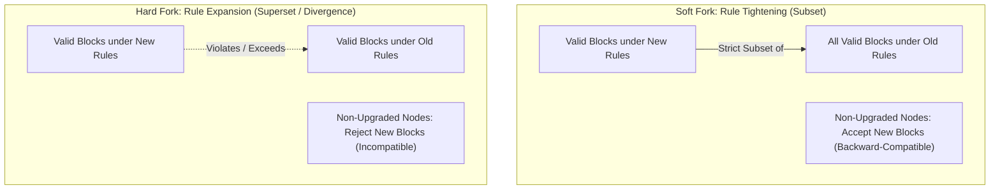
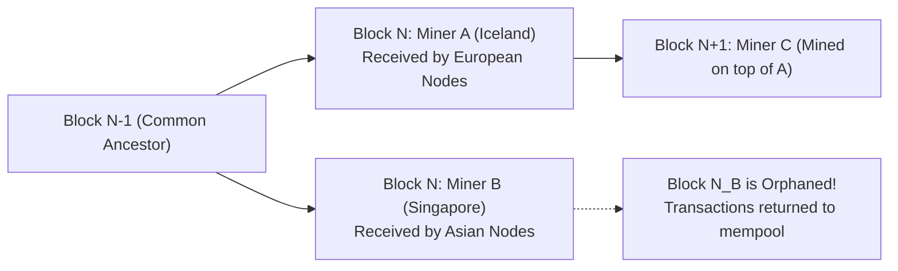
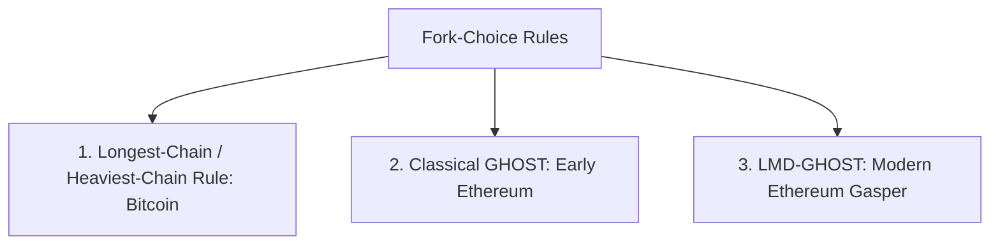
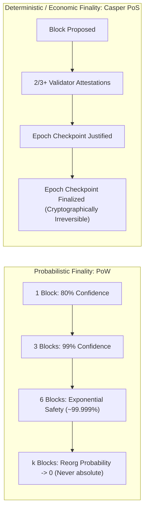

# Forks, Finality, and Reorganizations

In the previous module, we analyzed how blockchains organize internal state: from Bitcoin's discrete unspent transaction outputs (UTXOs) to Ethereum's global account balances.
However, regardless of how state is stored, every full node on the network must agree on exactly which blocks form the one true, unbroken ledger of history.

In a centralized database, establishing canonical truth is straightforward: the central database server contains the authoritative state, and whatever timestamp the primary database assigns to a transaction represents its final order.

In a decentralized peer-to-peer network, there is no global clock and no master server.
Thousands of independent nodes communicate across the public internet, where network latency, fiber-optic routing delays, and packet loss are continuous physical realities.
Because message delivery is variable, different nodes observe events in different chronological orders.

When two valid blocks are discovered at the identical block height, or when the underlying consensus software is upgraded, the blockchain branches into competing paths.
This phenomenon is a **fork**.
Understanding how distributed networks navigate forks, reorganize competing branches, and reach **finality** is essential to understanding blockchain security.

## The Dual Meaning of "Fork"

In blockchain terminology, the word "fork" describes two completely distinct concepts:
1. **Consensus Rule Upgrades (Soft Forks vs. Hard Forks):** Planned or contested modifications to the underlying software validation rules.
2. **Transient State Divergences (Chain Splits & Reorgs):** Accidental temporary branches caused by physical network latency and simultaneous block discovery.

Let us examine both phenomena in detail.

## Consensus Rule Upgrades: Soft Forks vs. Hard Forks

A blockchain is governed by strict mathematical validation rules embedded in its client software.
These rules dictate:
- What is the maximum allowable block size?
- What opcodes are recognized by the virtual machine?
- How are digital signatures verified?
- How is the Proof of Work difficulty calculated?

When developers upgrade client software, the relationship between the old validation rules and the new validation rules determines whether the upgrade is a **Soft Fork** or a **Hard Fork**.

### 1. Soft Forks: Backward-Compatible Rule Tightening

A soft fork occurs when the protocol rules are made **more restrictive**.
Any block that is valid under the new rules is also strictly valid under the old rules:

$$\text{Valid}_{\text{new}} \subset \text{Valid}_{\text{old}}$$

- **Backward Compatibility:** Non-upgraded nodes continue operating without interruption. When an upgraded miner produces a block under the tightened rules, older nodes still evaluate it as valid because it does not violate any legacy constraints.
- **Enforcement Mechanics:** As long as a majority of mining hash power or validator stake (typically $> 51\%$ to $95\%$) adopts the new rules, the upgraded chain outpaces the legacy chain.
  Non-upgraded nodes are forced to follow the upgraded chain simply by adhering to the longest-chain rule.
- **Historical Case Studies:**
  - **BIP-66 (Strict DER Signatures on Bitcoin, 2015):** Restricted ECDSA signatures to strict DER encoding, eliminating signature malleability vulnerabilities.
  - **BIP-141 (Segregated Witness / SegWit on Bitcoin, 2017):** Moved cryptographic witness data into a separate tree outside the legacy 1 MB base block serialization.
    To non-upgraded nodes, SegWit outputs appeared as open "anyone-can-spend" scripts.
    Older nodes accepted the blocks because they did not violate the 1 MB cap, while upgraded nodes enforced the digital signatures contained in the witness structure.
  - **BIP-340/341/342 (Taproot on Bitcoin, 2021):** Introduced Schnorr signatures and MAST script trees by redefining existing unused `OP_SUCCESS` opcodes.

### 2. Hard Forks: Non-Backward-Compatible Rule Expansions

A hard fork occurs when the protocol rules are **loosened, expanded, or fundamentally altered** such that blocks valid under the new rules are deemed strictly invalid by older client software:

$$\text{Valid}_{\text{new}} \not\subset \text{Valid}_{\text{old}}$$

- **Non-Backward Compatibility:** Older nodes cannot process the new blocks.
  When an upgraded node broadcasts a block exceeding legacy limits (for example, a 2 MB block on a 1 MB network), older nodes immediately drop the block as invalid.
- **Permanent Chain Split Risk:** If 100 percent of the community agrees on the upgrade, everyone switches software and the old chain ceases to exist.
  However, if a faction of miners, exchanges, or users refuses to adopt the new rules, the blockchain permanently divides into two independent, competing ledgers sharing a common genesis history.
- **Historical Case Studies:**
  - **The 2013 Bitcoin Database Split (March 2013):** Bitcoin Core 0.8 switched database backends from BerkeleyDB to LevelDB. A miner running 0.8 created a block with an unusually large number of transaction inputs. Version 0.8 nodes accepted the block, but older 0.7 nodes (constrained by BerkeleyDB locks) rejected it. The network split into two competing chains for six hours until mining pools coordinated in IRC chat to downgrade back to 0.7, demonstrating how unintended software deviations can trigger accidental hard forks.
  - **The DAO Fork (Ethereum, 2016):** An attacker exploited a reentrancy vulnerability in The DAO smart contract, draining 3.6 million ETH.
    The community voted to execute an irregular state change hard fork to transfer the stolen funds to a recovery contract.
    An ideological minority faction argued that "Code is Law" and refused to alter history, permanently preserving **Ethereum Classic (ETC)** alongside **Ethereum (ETH)**.
  - **The Block Size War (Bitcoin, 2017):** Disagreements over transaction throughput led a faction of miners and developers to hard-fork Bitcoin to increase the base block limit from 1 MB to 8 MB, splitting into **Bitcoin (BTC)** and **Bitcoin Cash (BCH)**.
  - **The Merge (Ethereum, 2022):** A planned, consensus-level hard fork that permanently deprecated Proof of Work mining and transitioned Ethereum to the Proof of Stake Beacon Chain.

| Dimension | Soft Fork | Hard Fork |
| :--- | :--- | :--- |
| **Rule Direction** | Tightening / Restricting valid state space | Loosening / Expanding valid state space |
| **Backward Compatibility** | **Yes:** Older nodes accept new blocks | **No:** Older nodes reject new blocks |
| **Upgrade Urgency** | Mandatory for miners; optional for light clients & users | Mandatory for all participating nodes |
| **Split Risk** | Low (if hash power majority enforces rules) | High (guarantees split if legacy nodes persist) |

## Transient Forks and Block Reorganizations (Reorgs)

Even when all nodes run the exact same software version, forks still happen naturally every day due to the physical realities of global networking.

Consider a distributed scenario:
1. Miner A in Iceland discovers a valid block at height $N$.
2. At the exact same millisecond, Miner B in Singapore discovers an equally valid block at height $N$.
3. Both miners immediately broadcast their discoveries to their local peers.

Because light takes roughly 100 to 200 milliseconds to travel through fiber cables across the planet:
- Nodes in Europe receive Block $N_A$ first, declare it the tip of their chain, and begin mining on top of it.
- Nodes in Asia receive Block $N_B$ first, declare it the tip of their chain, and begin mining on top of it.

The network is now temporarily split into two valid realities.
How is this resolved without human intervention?
Through the **Fork-Choice Rule**.

### The Mechanics of a Reorganization

Miners continue working on whichever block they received first.
Because mining is a memoryless Poisson process, it is mathematically near-impossible for both sides of the network to discover Block $N+1$ at the identical instant.

Eventually, Miner C discovers Block $N+1$ built on top of Block $N_A$ and broadcasts it globally:
1. When nodes in Asia (who were tracking $N_B$) receive Block $N+1$, their client software evaluates both branches.
2. The branch $[N-1 \to N_A \to N+1]$ contains **two blocks of proof of work**, whereas their local branch $[N-1 \to N_B]$ contains only **one block**.
3. Under the longest-chain rule, the nodes recognize that the $N_A$ branch has accumulated greater cumulative difficulty.
4. The Asian nodes execute a **Block Reorganization (Reorg)**:
   - They roll back the state transitions of Block $N_B$.
   - They apply the state transitions of Block $N_A$ and Block $N+1$.
   - Block $N_B$ is stripped of its status and becomes an **Orphaned Block** (or stale block).
   - Any transactions that were inside Block $N_B$ but not in $N_A$ or $N+1$ are automatically restored to the mempool to be picked up in future blocks.

### The Double-Spend Risk During Reorganizations

Reorganizations are not just operational inconveniences; they are the primary mechanism for financial double-spend attacks:
- Mallory deposits 1,000 coins into an exchange on Block $N_B$.
- The exchange credits Mallory's account after only 1 confirmation block and allows Mallory to withdraw fiat currency or other tokens.
- Simultaneously, Mallory secretly mines an alternative branch $[N_A \to N+1]$ where those same 1,000 coins are sent back to her own wallet.
- When Mallory releases her longer branch, the network executes a reorg to $[N_A \to N+1]$, orphaning Block $N_B$.
- The exchange's deposit is erased from canonical history, leaving the exchange defrauded.
- This is precisely why exchanges require multiple confirmation blocks before crediting user balances.

## Fork-Choice Rules: How Nodes Choose the Canonical Chain

A fork-choice rule is the deterministic algorithm that every node runs locally to resolve competing branches without trusting any external coordinator.

### 1. The Heaviest-Chain Rule (Accumulated Difficulty)

In Bitcoin, the canonical chain is commonly called the "longest chain", but technically it is the **heaviest chain**:

$$\text{Canonical Chain} = \arg\max_{\text{chain}} \sum_{i=1}^{M} \text{Difficulty}(B_i)$$

Nodes do not count raw block height.
They calculate the total cumulative Proof of Work difficulty embedded in the chain.
This prevents an attacker from creating an alternative private fork at very low difficulty with millions of blocks and convincing nodes that it represents the true history.

### 2. GHOST (Greedy Heaviest Observed Sub-Tree)

In networks with fast block intervals (such as Ethereum during its Proof of Work era, which produced blocks every 12 seconds), block propagation delays meant that accidental forks occurred in nearly 10 percent of blocks.
Under Bitcoin's strict longest-chain rule, all orphaned blocks are wasted, and miners outside central mining hubs suffer massive revenue penalties.

Yonatan Sompolinsky and Aviv Zohar designed the **GHOST protocol**:
- Instead of ignoring orphaned blocks, the chain includes references to them as **ommer** (or uncle) blocks.
- Uncle blocks contribute their Proof of Work weight to the main chain's security score.
- The miner of the uncle block receives a partial block subsidy (typically 75% to 87.5% of a full block reward).
- This eliminated the centralization advantage of large mining pools on fast-block networks.

### 3. LMD-GHOST (Latest Message Driven GHOST)

In modern Proof of Stake Ethereum, fork choice is not decided by computational hashing power.
It is decided by the weight of cryptographic votes (attestations) cast by staked validators.

Under **LMD-GHOST**:
- "Latest Message Driven" means the algorithm considers only the single most recent attestation message received from each registered validator.
- Starting from the finalized root, the algorithm traverses down the tree of blocks.
- At each fork branch, it chooses the child block that has accumulated the largest sum of validator stake attestations.

## Finality: When Does a Transaction Become Irreversible?

Finality is the property that once a transaction has been confirmed in a block, it can never be altered, reversed, or canceled.
Different blockchain architectures provide fundamentally different types of finality.

### 1. Probabilistic Finality (Proof of Work)

In Nakamoto consensus, **finality is never mathematically absolute; it is probabilistic**.

Suppose Alice's transaction is confirmed in Block $N$.
An attacker could secretly start mining an alternative private chain starting from Block $N-1$:
- If the attacker controls less than 50 percent of the hash rate ($q < 0.5$), their probability of out-mining the honest network decays exponentially with every block added to the honest chain.
- As shown by Satoshi Nakamoto in Section 11 of the Bitcoin whitepaper, after **6 confirmation blocks** (approximately 1 hour), the probability of an attacker with 10 percent hash rate catching up is less than $0.1\%$, and with 30 percent hash rate is less than $1.3\%$.

For high-value transactions, exchanges wait for 30 to 60 confirmations to achieve near-certain economic security, even though small reorganization risks theoretically exist indefinitely under 51 percent attacks.

### 2. Deterministic and Economic Finality (Casper FFG)

Modern Proof of Stake networks combine fork-choice rules with **finality gadgets** (such as Casper FFG) to provide deterministic finality.

In Ethereum:
- Validators cast checkpoint votes pairing epoch boundaries (every 32 slots / 6.4 minutes).
- When more than two-thirds ($> 66.7\%$) of the global validator stake signs an attestation linking Checkpoint A to Checkpoint B, Checkpoint B is **justified**.
- When the subsequent checkpoint is justified, Checkpoint B becomes **finalized**.

Once a block is finalized:
- Nodes will never, under any circumstances, reorganize or revert that block.
- If two conflicting finalized checkpoints ever appear at the same height, it is mathematically proven that at least one-third ($> 33.3\%$) of the entire global validator set double-signed conflicting votes.
- The protocol's automated slashing engine immediately identifies the conflicting BLS signatures and **burns their staked collateral permanently** (amounting to billions of dollars of slashed capital).

This elevates finality from an empirical probabilistic waiting game to an absolute **economic guarantee**: reversing a finalized transaction requires burning an astronomical, protocol-enforced economic penalty.

## The Next Question: Why Do Rational Actors Play by the Rules?

We have now established the structural mechanics of blockchains:
- How block headers seal transaction payloads into tamper-evident chains.
- How transactions traverse the lifecycle from client signing to state root mutation.
- How state models partition data into unspent outputs or global accounts.
- How fork-choice rules resolve network forks and establish probabilistic or economic finality.

However, mechanical rules alone cannot secure a decentralized network.
Software code can always be modified, forks can always be mined, and colluding validators can attempt to seize state.
Why do thousands of anonymous, self-interested participants across the globe cooperate to maintain the exact same ledger instead of cheating?
What prevents malicious actors from launching Sybil armies, executing selfish mining, or colluding to censor competitors?

To understand how cryptography fuses with economics, thermodynamics, and game theory, we step into **Module 3: Consensus Mechanisms and Game Theory**.
