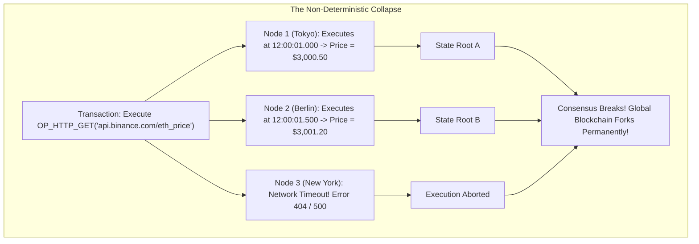
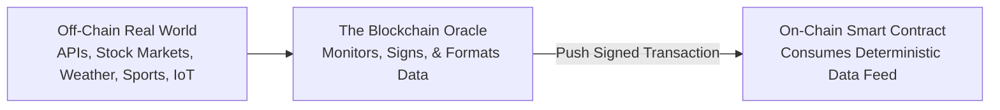
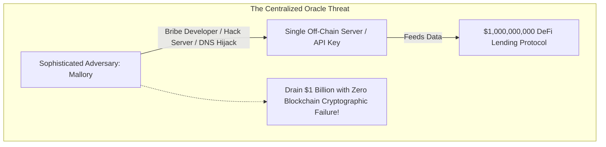
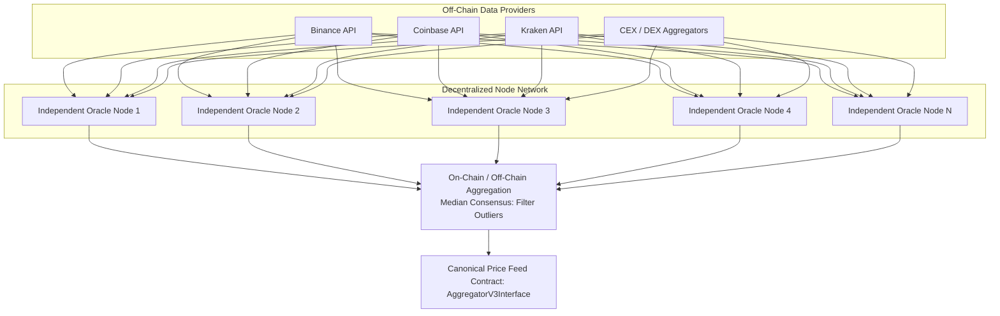
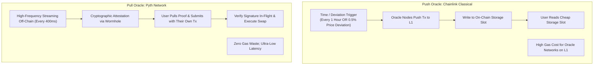
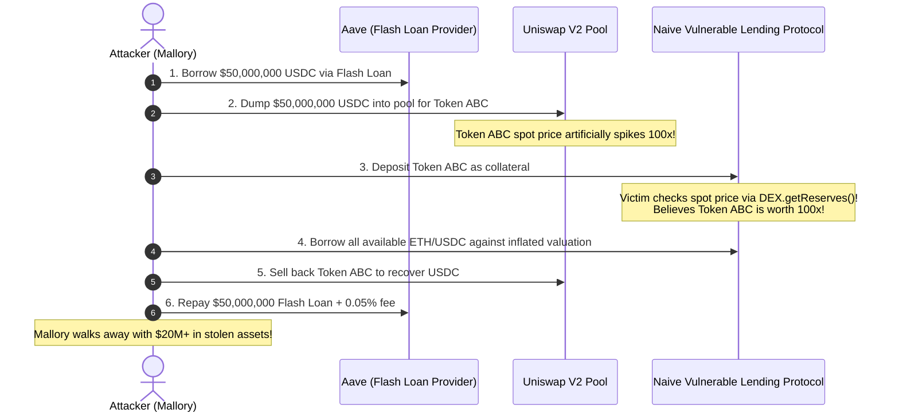
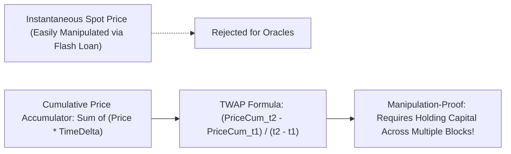

# The Oracle Problem

In the previous module, we examined how Account Abstraction and smart contract accounts revolutionize user security, key recovery, and transaction batching.
However, regardless of whether an account is controlled by a private key or a smart contract, all on-chain computation shares a fundamental limitation:
**Smart contracts are completely blind, deaf, and disconnected from the real world.**

Smart contracts are often described as self-executing agreements: if an agreed condition occurs, the contract automatically executes the corresponding action:
- *"If the price of ETH drops below $2,000, liquidate Alice's collateral."*
- *"If flight UA102 is delayed by more than two hours, disburse flight insurance payouts to Bob."*
- *"If Team A wins the championship, pay out the prediction market."*

Yet a smart contract cannot execute an HTTP `GET` request to check an API.
It cannot ping an airline database.
It cannot read the stock price of Apple on NASDAQ.
It cannot check the weather in New York City.

This structural barrier and the security risks associated with bridging off-chain data into an on-chain environment is known as **The Oracle Problem**.

## Why Blockchains Cannot Make HTTP Requests

A beginner's immediate instinct is to ask: *Why don't core blockchain developers simply add an opcode like `OP_HTTP_GET` to the EVM so contracts can fetch JSON from a REST API?*

To understand why this is physically impossible, one must revisit the foundational rule of decentralized consensus: **Determinism**.

Every full node in a blockchain must execute the exact same block of transactions and compute the **exact same 32-byte World State Root**:
1. If a contract could execute an HTTP request, Node 1 in Tokyo might query the Binance API at 12:00:01 and receive `$3,000.50`.
2. Node 2 in Berlin might query the same API 500 milliseconds later and receive `$3,001.20`.
3. Node 3 in New York might experience an ISP routing timeout and receive an HTTP 504 Gateway Error.
4. When nodes calculate the updated state root, their numbers mismatch.
5. The blockchain splits into competing forks, permanently destroying decentralized consensus.

Furthermore, if a new node joins the network five years from now and replays historical blocks from genesis, the external API server may no longer exist, making historical synchronization impossible.

Therefore:
> A blockchain must remain a strictly deterministic, isolated state machine.
> External data cannot be *pulled* by the blockchain; it must be cryptographically *pushed* onto the blockchain by an external entity through a signed transaction.

## Defining the Oracle

In classical mythology, an oracle was a priest or priestess who served as an conduit through whom the gods spoke to mortals.
In blockchain engineering, an **Oracle** is an entity or network that bridges the physical, off-chain world and the on-chain execution environment:

An oracle performs three sequential roles:
1. **Fetch:** Queries one or more external data sources (such as exchange APIs, weather sensors, or Bloomberg terminals).
2. **Attest:** Formats the raw data and signs it using a cryptographic private key.
3. **Commit:** Broadcasts a standard on-chain transaction calling an oracle contract, writing the verified data directly into the blockchain's persistent storage.

Once the data is committed on-chain, it becomes a deterministic state variable that any other smart contract can read cheaply and safely.

## The Centralized Oracle Paradox

If a smart contract relies on a **single centralized server or entity** to feed it data, the contract ceases to be decentralized.
It inherits the security profile of that single server:

If a decentralized lending protocol holds $1 billion in collateral, an attacker does not need to break Ethereum's cryptography or crack private keys.
The attacker only needs to:
- Hack the single server running the price feed.
- Bribe the server administrator.
- Execute a DNS spoofing or BGP routing hijack.

If the oracle falsely reports that the price of ETH is $0.01, the smart contract's liquidation engine faithfully executes its automated code, liquidating millions of innocent users like Alice and selling their collateral to Mallory for pennies.
**A decentralized smart contract is only as secure as the oracle that informs it.**

## Decentralized Oracle Networks (DONs)

To eliminate the single point of failure, developers engineered **Decentralized Oracle Networks (DONs)**, pioneered by **Chainlink**:

### The Chainlink Multi-Layer Aggregation Architecture

1. **Multiple Independent Node Operators:**
   The network recruits dozens of independent, professional node operators (such as Swisscom, Deutsche Telekom, and specialized crypto infrastructure providers).
2. **Multiple Independent Data Sources:**
   Every node independently queries multiple institutional-grade data aggregators (such as CoinGecko, CoinMarketCap, and Kaiko), ensuring no single exchange glitch distorts their report.
3. **Medianization and Outlier Rejection:**
   The nodes submit their signed observations.
   The protocol discards outliers and calculates the **statistical median**:
   $$\text{Final Consensus Price} = \text{Median}(P_1, P_2, \dots, P_n)$$
   Taking the median guarantees that an adversary must compromise **strictly more than 50 percent of the independent oracle nodes** to manipulate the price feed by even a single penny.
4. **Economic Staking and Reputation:**
   Nodes stake collateral that can be slashed if they report inaccurate data or experience downtime.

## Push vs. Pull Oracle Architectures

Modern decentralized finance uses two primary architectural patterns for delivering oracle data:

### 1. Push Oracles (Chainlink Classic)

- **Mechanics:** The oracle network monitors prices off-chain.
  When the price moves by more than a predefined deviation threshold (such as 0.5%) or a heartbeat timer expires (such as every 1 hour), the oracle network broadcasts a transaction to Layer 1, updating the on-chain storage variable.
- **Pros:** Simple for developers: a smart contract calls `latestRoundData()` to read the stored value in a single read operation.
- **Cons:** High gas costs for oracle operators, who must constantly pay Layer 1 fees even when no user is actively trading against that price feed.

### 2. Pull Oracles (Pyth Network, Chainlink Low-Latency)

- **Mechanics:** Oracle nodes stream signed price updates off-chain thousands of times per second.
  When a user executes a trade or liquidation on-chain, **the user's transaction fetches the latest cryptographic price update from the off-chain stream and submits it to the contract alongside their trade payload**.
- **In-Flight Verification:** The smart contract verifies the cryptographic signature on the price update in the exact same transaction, updates the price, and executes the trade.
- **Pros:** Sub-second latency (ideal for high-frequency perpetual trading) and zero gas waste: updates are written to the blockchain only when an end-user actually requires them.

## Flash Loan Oracle Manipulation Attacks

The most dangerous vulnerability in DeFi occurs when a protocol naively calculates asset prices by querying the current balance ratio of an **on-chain Automated Market Maker (AMM)** (such as a Uniswap V2 pair):

$$\text{Price}_{\text{naive}} = \frac{\text{Reserve}_Y}{\text{Reserve}_X}$$

Because AMM spot prices depend strictly on current pool reserves, an attacker can manipulate this price within a single atomic transaction using a **Flash Loan**:

### The Attack Walkthrough:

1. **Borrow:** Mallory borrows $50 million in USDC from a flash loan provider (which requires zero collateral, provided the loan is repaid within the same atomic transaction block).
2. **Manipulate:** Mallory dumps the entire $50 million into a Uniswap pool, draining Token ABC and artificially spiking its spot price by 100x.
3. **Exploit:** The victim protocol checks Token ABC's price by reading the AMM's immediate reserves.
   Believing Token ABC is worth 100x its true value, the protocol allows Mallory to borrow millions of dollars of real assets against virtually worthless collateral.
4. **Unwind & Repay:** Mallory sells back Token ABC, restores pool reserves, and repays the flash loan.
The victim protocol is left with millions in irrecoverable bad debt.

#### Real-World Battle Scars: Mango Markets and Harvest Finance
This attack is not theoretical.
In October 2022, an exploiter manipulated the oracle pricing of the MNGO token on Solana's **Mango Markets**, draining **$114 million** from the protocol's liquidity pools.
Similarly, in October 2020, **Harvest Finance** suffered a **$34 million** flash loan drain because its vault accounting relied on the spot price of Curve pools rather than time-weighted average prices.

## The Defense: Uniswap V2 Time-Weighted Average Price (TWAP)

To protect protocols against flash loan manipulation, Uniswap V2 introduced the **Time-Weighted Average Price (TWAP)**:

Instead of tracking spot prices, Uniswap V2 maintains a running **Cumulative Price Accumulator**:

$$a_t = \sum_{i=1}^t P_i \times \Delta t_i$$

To calculate the average price over a time window $[t_1, t_2]$:

$$\text{TWAP} = \frac{a_{t_2} - a_{t_1}}{t_2 - t_1}$$

Because a flash loan exists for **zero seconds** within a single transaction block ($\Delta t = 0$), a flash loan attacker cannot alter the TWAP accumulator.
Manipulating a 30-minute TWAP requires an attacker to hold millions of dollars of capital in a distorted state across hundreds of blocks, exposing them to massive arbitrage losses from other traders and making manipulation economically unviable.

## The Next Question: How Do We Coordinate Human Institutions on Code?

We have now conquered the computational and execution stack of blockchains:
- How Turing-complete smart contracts emerged from Bitcoin's static script.
- How the EVM manages volatile stack, linear memory, and persistent storage.
- How gas economics meters execution and prevents denial-of-service collapse.
- How programmable accounts and Account Abstraction eliminate private key vulnerabilities.
- How decentralized oracle networks bridge real-world physical events into deterministic contracts.

However, blockchains are not merely computational runtimes; they are **social, economic, and institutional coordination systems**.
When code governs billions of dollars of capital, who decides how that code changes?
How do **Decentralized Autonomous Organizations (DAOs)** coordinate thousands of anonymous human participants without corporate boards?
How do we engineer **Tokenomics** that balance inflation, utility, and game-theoretic incentives without collapsing into Ponzi dynamics?
How do we establish self-sovereign digital identity (DIDs) without dystopian biometric surveillance?
And how do we store decentralized content permanently without corporate cloud providers?

To explore how blockchains restructure human governance and digital coordination, we step into **Module 5: Decentralized Systems and Governance**.
