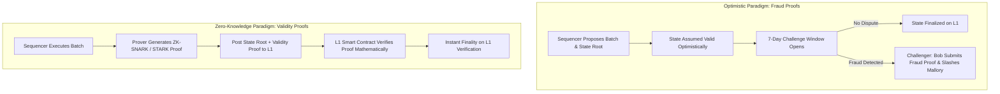
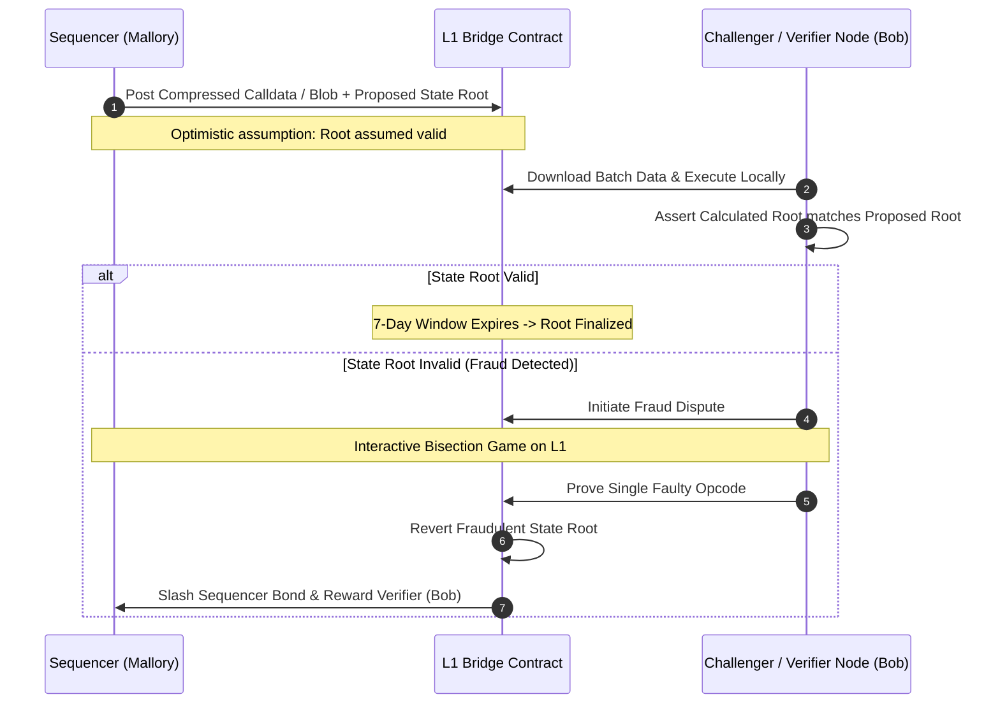
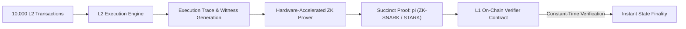

# Rollup Architectures: Optimistic vs. Zero-Knowledge

In the previous module, we established the foundational taxonomy of Layer 2 systems and saw that rollups are the only scaling architecture that fully inherits Layer 1 security by posting data availability directly to the base chain.
However, once transaction data is published on-chain, a critical question remains:
How does Layer 1 know whether the state root submitted by the rollup sequencer is truthful?

Rollup architectures diverge fundamentally in how they prove to Layer 1 that off-chain state transitions were computed correctly.
The two leading implementations are **Optimistic Rollups** and **Zero-Knowledge (Validity) Rollups**.

## The Two Proof Paradigms

The core distinction between Optimistic and Zero-Knowledge rollups lies in their verification philosophy:

- **Optimistic Rollups:** Assume all proposed state transitions are valid by default without verifying execution up front. Correctness is guaranteed retroactively through economic incentives and an interactive **fraud proof** challenge window.
- **Zero-Knowledge Rollups:** Assume nothing is valid until cryptographically proven. Every state update posted to L1 must be accompanied by a succinct mathematical **validity proof** (ZK-SNARK or ZK-STARK) evaluated by an on-chain verifier contract.

## Optimistic Rollups: Fraud Proof Mechanics

Optimistic rollups (such as Arbitrum One and Optimism Mainnet) execute transactions using an EVM-equivalent execution client.

### The 7-Day Challenge Window

To prevent an adversary sequencer (like Mallory) from submitting an invalid state root (such as minting one billion tokens to a private address), Optimistic Rollups enforce a mandatory **7-Day Dispute Window**.
During this period:
- Any full node in the network (like Bob) can download the batch data from L1, re-execute the transactions locally, and verify the resulting state root.
- If a discrepancy is detected, the verifier submits a fraud proof to the L1 contract.
- If no challenge occurs within seven days, the state root is finalized, and withdrawals to L1 are unlocked for users like Alice.

### Interactive Multi-Round Bisection (Arbitrum Nitro)

Submitting an entire failed block to L1 for execution would exceed L1 gas limits.
Instead, Arbitrum uses an **interactive bisection protocol**:
1. The challenger and the sequencer play a turn-based verification game coordinated by an L1 dispute contract.
2. The challenger asserts that the execution diverged over a range of $N$ instructions.
3. The players repeatedly bisect the disputed execution trace: $\frac{N}{2}, \frac{N}{4}, \dots, 1$.
4. Within $\mathcal{O}(\log N)$ rounds, they isolate the disagreement to a single atomic EVM instruction (such as an `ADD` or `SSTORE` opcode).
5. The L1 smart contract executes that single opcode within its own EVM runtime, verifies who was truthful, slashes the loser's bonded deposit, and rolls back the fraudulent root.

## Zero-Knowledge Rollups: Validity Proof Mechanics

Zero-Knowledge rollups (such as Starknet, zkSync Era, and Polygon zkEVM) rely on advanced polynomial cryptography to prove the correctness of off-chain execution.

### 1. Execution Traces and Arithmetization

Transactions execute off-chain, generating an execution trace of CPU registers, memory access lookups, and state mutations.
The compiler converts these traces into a set of multivariate algebraic polynomials (arithmetization via R1CS, Plonkish, or AIR representations).

### 2. Proof Generation (SNARKs vs. STARKs)

A cryptographic prover constructs a proof $\pi$ demonstrating that a valid sequence of transactions transformed state root $S_t$ into $S_{t+1}$ according to virtual machine rules:

- **ZK-SNARK (Succinct Non-Interactive Argument of Knowledge):** Ultra-compact proof sizes (hundreds of bytes) and fast verification times ($\sim 200,000$ gas on L1). Older variants (Groth16) require a trusted cryptographic setup, while modern systems (PLONK, Halo2) use transparent setups.
- **ZK-STARK (Scalable Transparent Argument of Knowledge):** Relies solely on cryptographic hash functions and Reed-Solomon error-correcting codes. Transparent (zero trusted setup) and post-quantum secure, but produces larger proof byte sizes (dozens of kilobytes).

### 3. Immediate Finality

When the prover submits the proof $\pi$ to the L1 verifier contract, the contract evaluates the mathematical pairing equations.
If the equations check out, the state update is instantly finalized.
There is no challenge period.
Users like Alice can withdraw funds back to Layer 1 as soon as the block containing the validity proof is mined on L1 (typically within minutes to hours).

## Deep Architectural Comparison

| Architectural Dimension | Optimistic Rollups | Zero-Knowledge Rollups |
| :--- | :--- | :--- |
| **Trust Model** | $1$-of-$N$ honest verifier assumption (Safety preserved if at least one honest node runs fraud checks) | Pure cryptographic truth (No honest verifier assumption required) |
| **L1 Verification Cost** | Extremely low during normal operations (Only simple state root updates; high only during fraud dispute) | Fixed base gas cost per proof verification ($\approx 200\text{k} - 400\text{k}$ L1 gas) |
| **Prover Computational Cost** | Minimal (Standard commodity CPU server running execution client) | Substantial (Massive GPU / FPGA / ASIC clusters computing complex polynomial proofs) |
| **L1 Withdrawal Latency** | 7-day delay required for challenge dispute window | Immediate upon proof verification ($\approx 15 \text{ min} - 2 \text{ hours}$) |
| **EVM Equivalence** | High (Direct fork of Geth / Erigon codebases) | Complex (Requires compiling EVM to ZK circuits: zkEVM Type 1-4) |
| **Data Compression Efficiency** | Moderate (Calldata / Blobs must contain signatures for validation)| Extreme (Signatures verified off-chain; only final state deltas posted to L1) |

## The Next Question: How Do We Connect Fragmented Chains?

The emergence of dozens of Layer 2 rollups and sovereign Layer 1 networks successfully expands global throughput.
However, it also introduces a severe operational consequence: **Liquidity Fragmentation**.

Capital and users are now scattered across Ethereum, Arbitrum, Optimism, Base, Solana, and Avalanche.
If Alice holds USDC on Arbitrum but wants to participate in a liquidity pool on Base or purchase an NFT on Solana, how does value travel between completely independent blockchain state machines?

How do **Cross-Chain Bridges** coordinate lock-and-mint or burn-and-mint mechanisms across different networks?
Why did Vitalik Buterin famously warn that cross-chain bridges face fundamental security limits that rollups do not?
And why have cross-chain bridges been the target of the largest hacks in financial history?
To examine the plumbing and vulnerabilities of cross-chain messaging, we turn to **Interoperability and Cross-Chain Bridges**.
