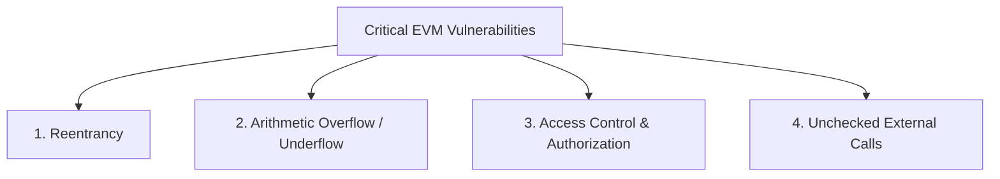
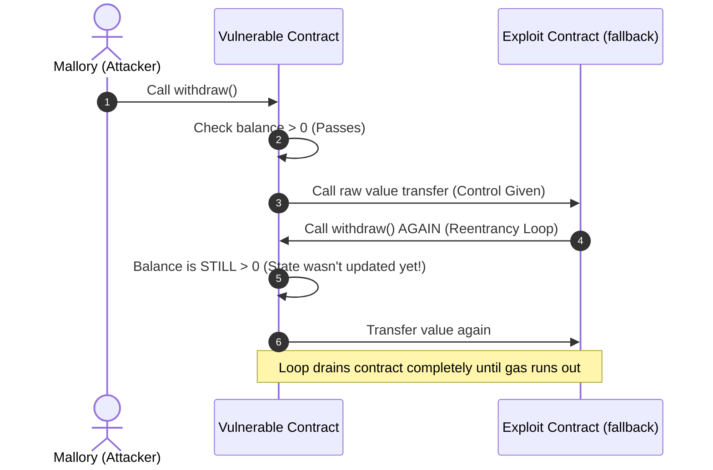
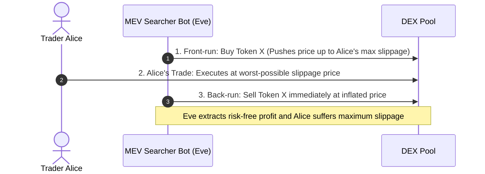
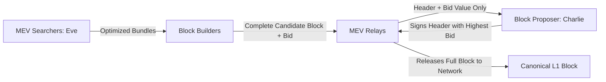

# Protocol Security and Maximum Extractable Value

In the previous module, we examined the vulnerabilities of cross-chain bridges and saw how multi-hundred-million-dollar exploits occur when cryptographic verification fails or multi-sig keys are compromised.
The reality of public blockchains is that they are deeply adversarial environments.
Unlike traditional software where source code and databases sit protected behind corporate firewalls, smart contract bytecode, execution state, and pending transaction pools are open to the entire internet.
Any economic flaw, reentrancy bug, or transaction ordering exploit can be targeted by automated bots within seconds of discovery.
Protocol security requires understanding low-level virtual machine vulnerabilities alongside game-theoretic exploitation via Maximum Extractable Value (MEV).

## Core Smart Contract Vulnerabilities

Smart contract bugs frequently arise from the impedance mismatch between high-level programming assumptions and low-level EVM execution mechanics.



### 1. Reentrancy Attacks

A reentrancy vulnerability occurs when a contract makes an external call to an untrusted address before resolving its internal state updates.
The recipient can hijack control flow and recursively call back into the original contract before the initial execution has updated balances.

```solidity
// Vulnerable withdrawal function: State updated AFTER external call
function withdraw() public {
    uint256 balance = balances[msg.sender];
    require(balance > 0, "No balance");

    // External call surrenders execution control to recipient
    (bool success, ) = msg.sender.call{value: balance}("");
    require(success, "Transfer failed");

    // Execution never reaches this line before attacker drains contract
    balances[msg.sender] = 0;
}
```



#### Defenses against Reentrancy:
- **Checks-Effects-Interactions (CEI) Pattern:** Always update internal state variables and zero out balances **before** making external calls.
- **Reentrancy Guards:** Implement non-reentrant mutex locks (such as OpenZeppelin's `ReentrancyGuard`) that revert if execution re-enters a protected function before completion.

### 2. Arithmetic Overflow and Underflow

Prior to Solidity version 0.8.0, arithmetic operations wrapped around silently without throwing errors.
For example, subtracting 1 from a `uint256` value of zero wrapped to $2^{256} - 1$.
Modern Solidity includes built-in compiler overflow checks that automatically invoke `REVERT` on mathematical underflows, eliminating the need for historical libraries like OpenZeppelin `SafeMath` unless developers explicitly use the `unchecked { ... }` block for gas optimization.

### 3. Access Control and Authorization Failures

Failing to restrict administrative functions (such as `initialize()`, `upgradeTo()`, or `setFeeRecipient()`) allows any external caller to take ownership of contract storage.
A famous example was the Parity Multi-Sig wallet freeze in 2017, where an uninitialized library contract allowed an attacker to call `initWallet()`, claim contract ownership, and invoke `selfdestruct()`, permanently locking 513,774 ETH.

## Maximum Extractable Value (MEV)

Phil Daian et al. formalized Maximum Extractable Value (initially Miner Extractable Value) in their 2019 paper *Flash Boys 2.0*.
MEV is the maximum value that can be extracted from block production in excess of the standard block reward and gas fees by including, excluding, or changing the chronological order of transactions within a block.

```mermaid
flowchart TD
    Mempool[Public Mempool: Unconfirmed Txs] --> Searchers[MEV Searchers: Algorithmic Bots (Eve)]
    Searchers -->|Simulate & Construct Bundles| Bundles["Private Bundles (Tx Front-Run + Target + Back-Run)"]
    Bundles --> Builders[Block Builders]
    Builders -->|MEV-Boost Auction: Direct Tip| Proposers[Block Proposers / Validators (Charlie)]
```

### Common MEV Extraction Strategies

#### 1. Front-Running and Back-Running

- **Front-Running:** A searcher bot (Eve) detects a pending profitable trade in the public mempool (such as an oracle liquidation or large DEX swap) and submits the identical transaction with a higher priority gas fee to ensure it is mined earlier.
- **Back-Running:** A searcher bot detects a large trade that will shift AMM pool prices and submits an immediate arbitrage swap right behind it to capture the resulting price discrepancy.

#### 2. The Sandwich Attack

A predatory MEV pattern targeting decentralized exchange traders who set high slippage tolerances:



#### 3. Liquidations

Searcher bots monitor lending protocols 24/7.
The moment an oracle transaction updates prices, hundreds of bots compete in priority gas auctions (PGA) to execute the liquidation within the identical block, capturing the liquidation bonus.

## The Architecture of Modern MEV: MEV-Boost and PBS

In early Proof of Work and Proof of Stake, validators captured MEV directly by inspecting their local mempools and reordering transactions.
This created dangerous network centralization: large validator cartels with specialized algorithmic infrastructure earned significantly higher yields than individual home stakers.

To preserve validator decentralization, Ethereum adopted **Proposer-Builder Separation (PBS)** via the off-chain **MEV-Boost** middleware:



1. **Searchers:** Specialized algorithmic bots identify arbitrage opportunities, construct atomic bundles of transactions, and submit them privately to block builders.
2. **Builders:** Specialized high-performance servers assemble bundles and public mempool transactions into complete, optimal candidate blocks that maximize total block value.
3. **Relays:** Trusted data escrow agents that verify block validity and prevent builders from cheating proposers, or proposers from stealing MEV strategies before signing.
4. **Proposers:** The designated slot validator (Charlie) does not know the internal contents of the block.
   Charlie merely signs the header of the block builder who submits the highest economic bid.

Through PBS, complex algorithmic MEV extraction is decoupled from consensus validation, allowing solo home stakers to earn competitive MEV yields without running high-frequency trading infrastructure.

## Modern Protocol Defense: Fuzzing and Formal Verification

To defend against sophisticated exploiters, modern protocol development has advanced far beyond manual code reviews:
- **Property-Based and Invariant Fuzzing:** Using frameworks like Foundry and Echidna, developers define mathematical invariants that must hold true across every block (such as "Total pool assets must always equal total LP shares"). Automated fuzzer engines generate millions of random transaction permutations to break these invariants before mainnet deployment.
- **Formal Verification:** Using tools like Certora Prover or Halmos, developers mathematically prove that smart contract bytecode adheres strictly to formal specifications, eliminating logic errors.
- **Private Mempools and Order Flow Auctions:** To protect retail users from predatory sandwich attacks, private RPC endpoints (such as Flashbots Protect and MEV-Share) route transactions directly to builders, bypassing the public mempool and refunding captured MEV back to users.

## The Journey Across Fundamentals

You have now completed the entire **Fundamentals Track**, traversing the full conceptual, architectural, and game-theoretic stack of decentralized systems:

1. **Foundations of Distributed Trust:** From Yap Island Rai stones and medieval tally sticks to the Byzantine Generals Problem, asymmetric cryptography, and peer-to-peer networks.
2. **Blockchain Architecture and State Models:** Block anatomies, the Dark Forest mempool, UTXO vs Account models, and fork finality.
3. **Consensus Mechanisms and Game Theory:** Proof of Work difficulty adjustments, Proof of Stake economic finality, and hybrid consensus models.
4. **Programmability and the Virtual Machine:** Turing completeness, EVM internals, gas economics, account abstraction, and decentralized oracles.
5. **Decentralized Systems and Governance:** Token standards, automated market makers, collateralized lending, veTokenomics, and decentralized autonomous organizations.
6. **Scalability and Security:** The Blockchain Trilemma, Layer 2 rollups, cross-chain bridges, smart contract security, and MEV.

With this rigorous architectural foundation established, you are equipped to explore specialized engineering tracks across advanced cryptography, smart contract development, protocol design, and zero-knowledge proofs.
